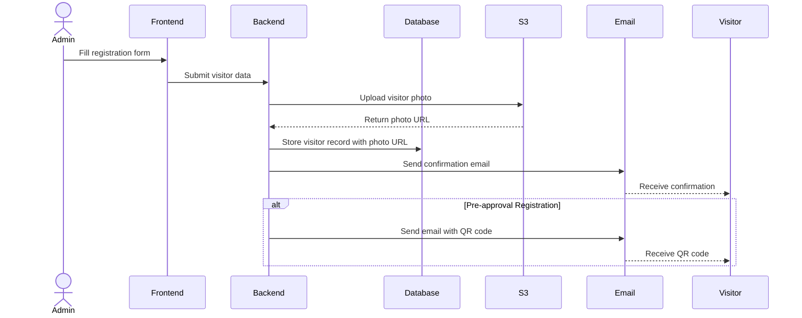
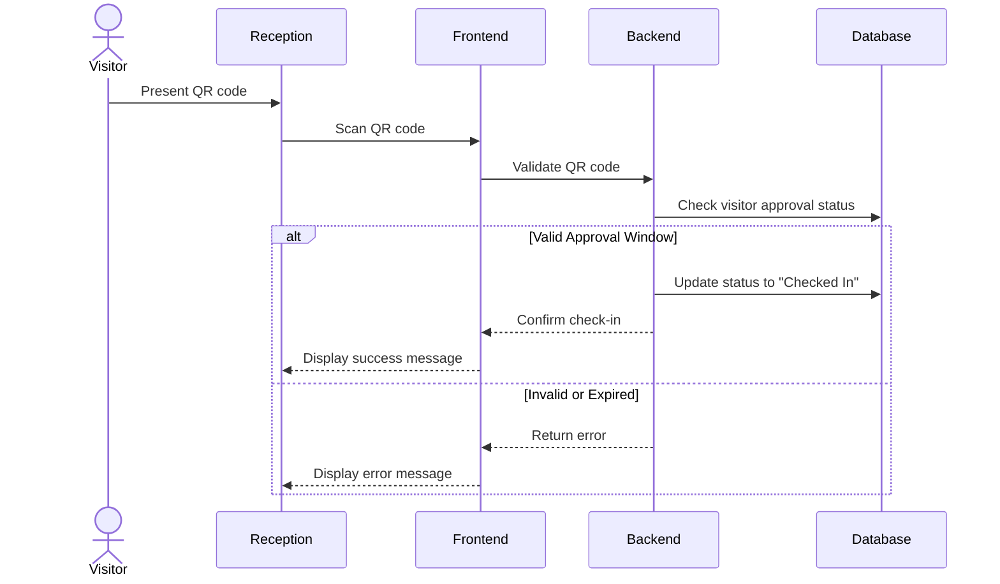

# ServiceInSync

<div align="center">

  

*A comprehensive digital solution for efficient visitor management*

[](https://reactjs.org/)
[](https://vitejs.dev/)
[](https://tailwindcss.com/)
[](https://flask.palletsprojects.com/)
[](https://www.sqlite.org/)
[](https://www.python.org/)
[](https://aws.amazon.com/s3/)
[](https://jwt.io/)

</div>

## 📋 Overview

GuestFlow is a modern visitor management system developed using React, Flask, and SQLite. It streamlines the entire visitor management process from registration to check-out with features like pre-approval workflows, QR code-based check-in/out, real-time updates, and insightful dashboards.

## ✨ Key Features

- **Dual Registration Workflows**: Standard and pre-approval registration processes
- **QR Code Integration**: Secure, contactless check-in and check-out
- **Real-time Notifications**: Email confirmations and status updates
- **Responsive Design**: Seamless experience across desktop and mobile devices
- **Secure Authentication**: JWT-based authentication with expiry
- **Analytics Dashboard**: Visualized insights into visitor patterns
- **Cloud Storage**: AWS S3 integration for secure visitor photo storage
- **Search & Filter**: Easily find and manage visitor records


## 💻 Tech Stack

| Component | Technology |
|-----------|------------|
| **Frontend** | React (Vite), Tailwind CSS, Recharts |
| **Backend** | Python Flask, SQLAlchemy |
| **Database** | SQLite |
| **Authentication** | JWT Tokens (1-hour expiry) |
| **Cloud Storage** | AWS S3 |
| **Email Service** | EmailJS |
| **QR Code** | qrcode (React), react-qr-reader |
| **Notifications** | react-toastify |

## 🔄 User Workflows

### Visitor Registration Flow



### Check-in Process



## 📊 Dashboard Insights

The analytics dashboard provides valuable insights including:

- Visitor traffic patterns by time and date
- Average visit duration
- Most frequent visitors
- Peak hours visualization
- Visitor status distribution
- Recently visited visitors


## 🔐 Authentication & Security

- **JWT Token Authentication**: Secure, stateless authentication
- **Token Expiry**: 1-hour session timeout for enhanced security
- **Photo Verification**: Mandatory photo upload for visitor identification
- **Secure Storage**: AWS S3 integration for media storage
- **Role-based Access**: Different permissions for administrators and reception staff

## 🚀 Installation & Setup

### Prerequisites
- Node.js (v14 or above)
- Python (v3.8 or above)
- npm or yarn
- pip

### Frontend Setup
```bash
# Clone the repository
git clone https://github.com/yourusername/guestflow.git
cd guestflow/frontend

# Install dependencies
npm install

# Start development server
npm run dev
```

### Backend Setup
```bash
# Navigate to backend directory
cd ../server

# Create virtual environment (Optional)
python -m venv venv
source venv/bin/activate  # On Windows: venv\Scripts\activate

# Start the server
python app.py
```

### Environment Configuration
Create a `.env` file in the backend directory with the following variables:
```
JWT_SECRET_KEY=your_jwt_secret
AWS_ACCESS_KEY_ID=your_aws_access_key
AWS_SECRET_ACCESS_KEY=your_aws_secret_key
AWS_BUCKET_NAME=your_s3_bucket_name
EMAILJS_USER_ID=your_emailjs_user_id
EMAILJS_SERVICE_ID=your_emailjs_service_id
EMAILJS_TEMPLATE_ID=your_emailjs_template_id
```

## 📝 API Documentation

| Endpoint | Method | Description | Authentication |
|----------|--------|-------------|----------------|
| `/api/auth/login` | POST | User authentication | No |
| `/api/auth/register` | POST | Register new staff user | No |
| `/api/auth/users` | GET | Get all users (admin only) | Yes |
| `/api/visitors` | GET | Get all visitors | Yes |
| `/api/visitors/not-pre-approve` | POST | Create regular visitor | Yes |
| `/api/visitors/pre-approve` | POST | Create pre-approved visitor | Yes |
| `/api/visitors/<id>` | GET | Get visitor details | Yes |
| `/api/visitors/<id>/approve` | PUT | Approve pending visitor | Yes |
| `/api/visitors/<id>/reject` | PUT | Reject pending visitor | Yes |
| `/api/visitors/<id>/check-in` | PUT | Process visitor check-in | Yes |
| `/api/visitors/<id>/check-out` | PUT | Process visitor check-out | Yes |
| `/api/dashboard/stats` | GET | Get dashboard statistics | Yes |

## 📱 Responsive Design

GuestFlow is fully responsive and provides an optimal experience across a wide range of devices:

- Desktop
- Mobile
- Tablet

## 📄 License

This project is licensed under the Apache-2.0 License - see the LICENSE file for details.

<div align="center">
  
**Made with ❤️ by Samarth**

</div>
